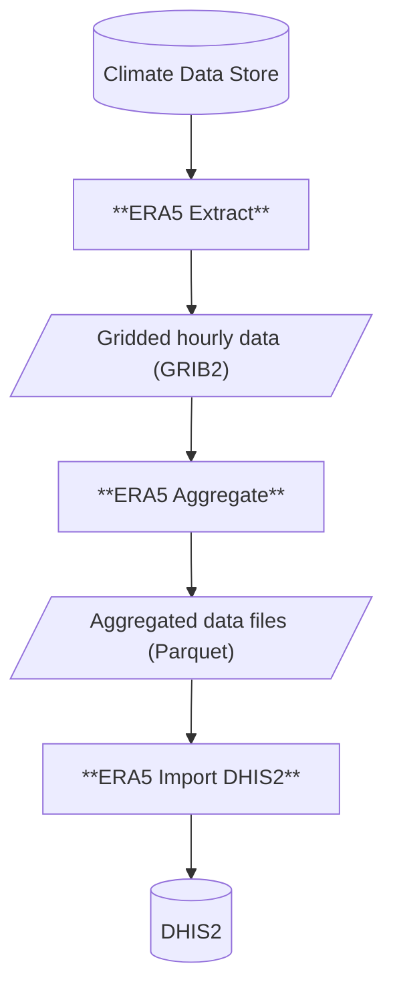

The repository contains OpenHEXA ETL pipelines to ingest climate data from the ERA5-Land dataset in
the [Climate Data
Store](https://cds.climate.copernicus.eu/datasets/reanalysis-era5-land?tab=overview). They heavily
rely on the `openhexa.toolbox.era5` package (see [openhexa-toolbox
repo](https://github.com/BLSQ/openhexa-toolbox/tree/main/openhexa/toolbox/era5) for more info).

Three DAGs are available:

* [`era5_extract`](era5_extract/README.md): download/sync raw ERA5 hourly data from the CDS for a given area of interest
* [`era5_aggregate`](era5_aggregate/README.md): aggregate raw hourly data in space and time according to an input geographic
  file (ex: administrative boundaries)
* [`era5_import_dhis2`](era5_import_dhis2/README.md): import ERA5 aggregated climate statistics into DHIS2 datasets

Pipelines documentation is available in the respective subdirectories.

## Deployment

To deploy the pipelines to an OpenHEXA workspace, edit the `.github/workflows/<pipeline_name>.yml` file accordingly.

In the following example, the `era5_extract` pipeline is automatically deployed 3 times (once per climate variable) to 3 different workspaces:

```yaml
jobs:
  deploy:
    strategy:
      matrix:
        pipeline: [
          {"workspace": "civ-data-integration-3cfb03", "pipeline_id": "era5_extract_temperature", "token": OH_TOKEN_CIV},
          {"workspace": "civ-data-integration-3cfb03", "pipeline_id": "era5_extract_precipitation", "token": OH_TOKEN_CIV},
          {"workspace": "civ-data-integration-3cfb03", "pipeline_id": "era5_extract_humidity", "token": OH_TOKEN_CIV},
          {"workspace": "bfa-malaria-data-reposi-b1b366", "pipeline_id": "era5_extract_temperature", "token": OH_TOKEN_BFA},
          {"workspace": "bfa-malaria-data-reposi-b1b366", "pipeline_id": "era5_extract_precipitation", "token": OH_TOKEN_BFA},
          {"workspace": "bfa-malaria-data-reposi-b1b366", "pipeline_id": "era5_extract_humidity", "token": OH_TOKEN_BFA},
          {"workspace": "niger-nmdr", "pipeline_id": "era5_extract_temperature", "token": OH_TOKEN_NER},
          {"workspace": "niger-nmdr", "pipeline_id": "era5_extract_precipitation", "token": OH_TOKEN_NER},
          {"workspace": "niger-nmdr", "pipeline_id": "era5_extract_humidity", "token": OH_TOKEN_NER}
        ]
```

New pipeline versions will be automatically deployed to the workspaces listed in the job matrix after each push to the `main` branch.

## Flow


