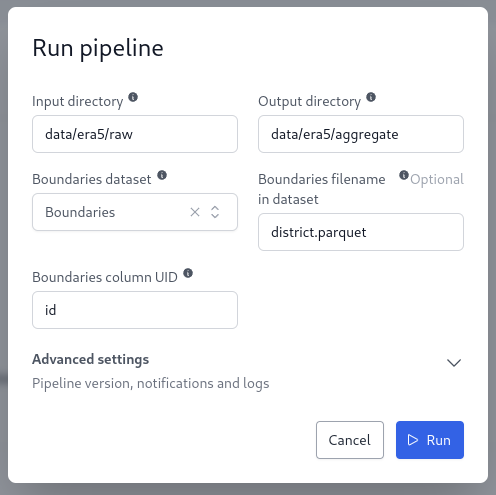
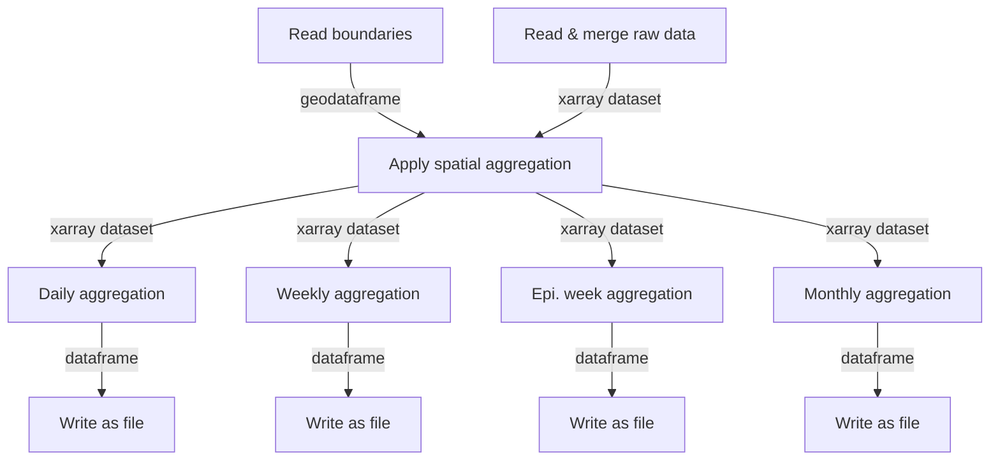

# ERA5 Aggregate Pipeline

This repository contains the OpenHEXA ETL pipeline to aggregate climate data from the ERA5-Land dataset in the [Climate Data Store](https://cds.climate.copernicus.eu/datasets/reanalysis-era5-land?tab=overview). The pipeline relies on the `openhexa.toolbox.era5` package.

## ERA5 Aggregate Pipeline

The `era5_aggregate` pipeline aggregates raw hourly data in space and time according to an input geographic file.

### Parameters

- **Input directory**: Input directory with raw ERA5 extracts in GRIB2 format (`*.grib`).
- **Output directory**: Output directory for the aggregated data.
- **Boundaries dataset**: Input dataset containing boundaries geometries (`*.parquet`, `*.geojson` or `*.gpkg`).
- **Boundaries filename**: Filename of the boundaries file to use in the boundaries dataset.
- **Boundaries column UID**: Column name containing unique identifier for boundaries geometries.

### Example Usage

### Data Aggregation

The pipeline reads the boundaries dataset, merges raw data files, and performs spatial aggregation to generate daily, weekly, and monthly aggregated data.

